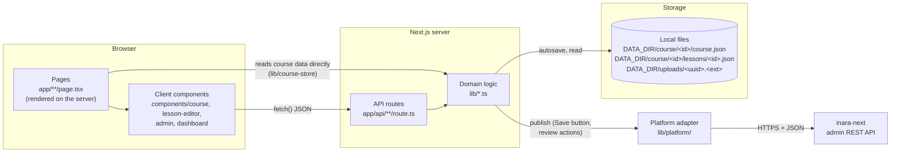
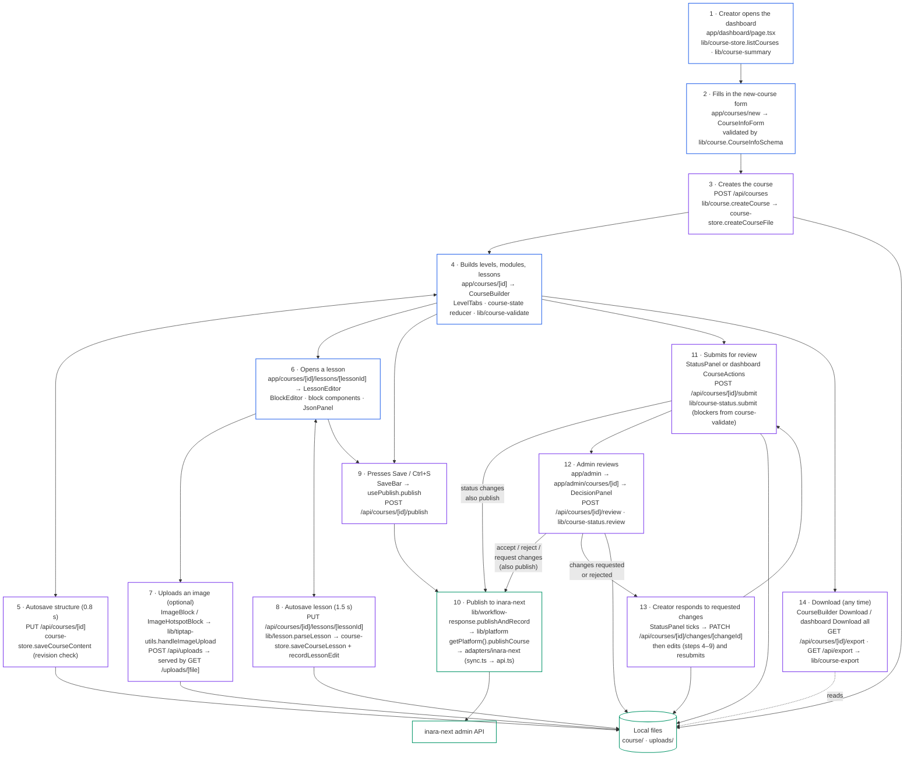
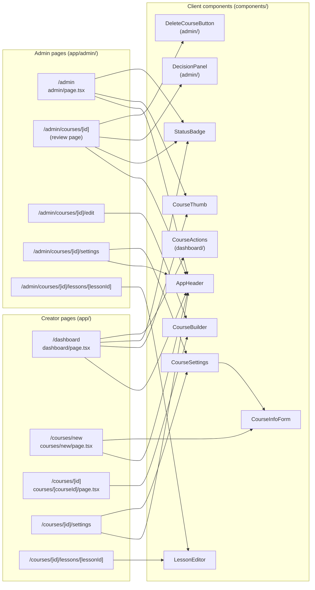
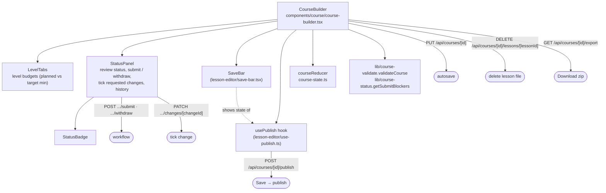
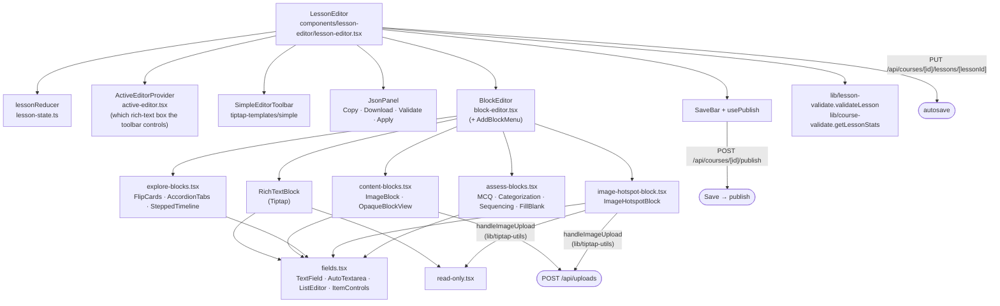
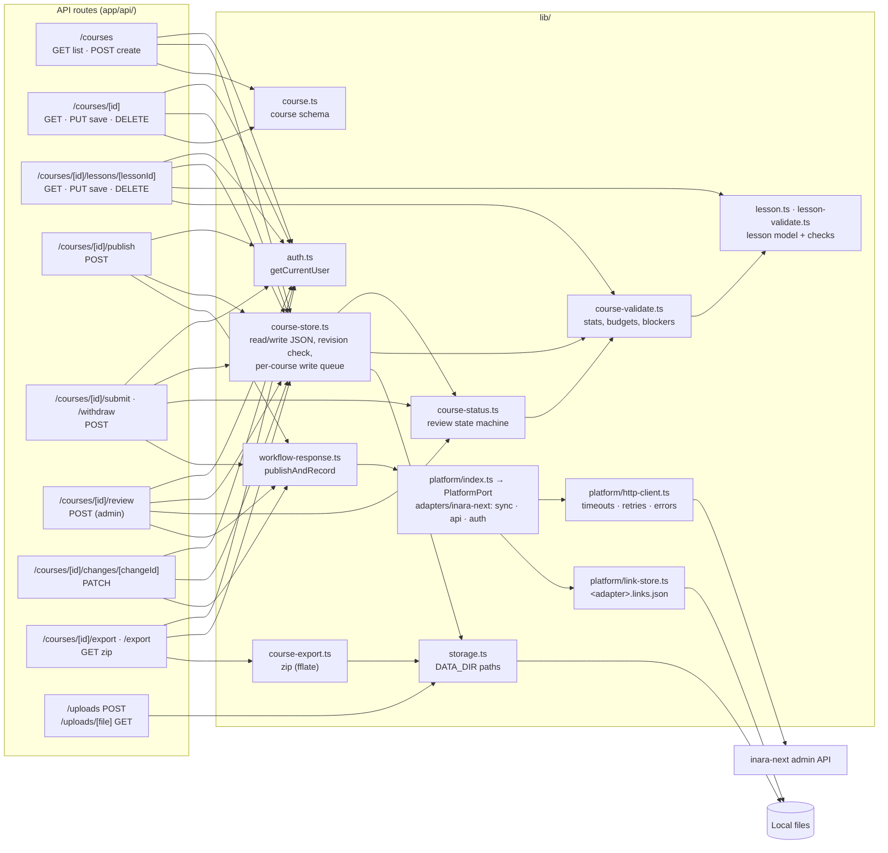
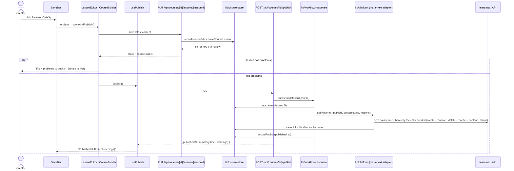

# Inara Course Editor: architecture and component map

Last updated: 2026-10-01. Companion to [HANDOVER.md](HANDOVER.md), which covers running, testing and
known issues.

Every page, component, API route and library module in the editor appears below, along with how
they connect. Every request follows the same path:

**page** (server) → **component** (browser) → **API route** (server) → **lib module** → **local
files**, or **inara-next's API** when publishing

The diagrams were built from the actual `import` statements and `fetch` calls in the code. If you
add or move a file, update the diagram and the index (section 7).

---

## 1. System at a glance

- **Pages** run on the server. They read course data with `lib/course-store` and pass it to the
  client components as props.
- **Client components** do everything interactive and talk to the server only through `fetch()`
  calls to `/api/...`.
- **API routes** are thin. They check access, validate input with zod, and call `lib/`.
- **`lib/`** holds all the rules (schemas, validation, review state machine, storage). It's the only
  layer that touches files.
- **`lib/platform/`** is the only code that talks to inara-next. The editor calls one interface,
  `PlatformPort`; the inara-next adapter turns that into inara-next API calls (see
  [platform-integration.md](platform-integration.md)).

---

## 2. End-to-end working flow, with every step mapped

Each box shows **what happens**, then the **component → endpoint → lib module** that does it.

**Key:** blue = browser UI, purple = API request, green = storage.

---

## 3. Page → component map

Which page renders which client component, and which `lib` modules it reads on the server.

- The admin pages reuse the creator components with `isAdmin` set.
- `lib/admin-mode.ts` then adds the `x-inara-mode: admin` header to their requests and switches
  their links to `/admin/...`.

---

## 4. Inside the two big components

### Course builder

### Lesson editor

**Block type → component:**

| Block type (`lib/lesson.ts`) | Category | Component |
|---|---|---|
| `rich_text` | Content | `RichTextBlock` |
| `image` | Content | `ImageBlock` |
| `image_hotspot` | Explore | `ImageHotspotBlock` |
| `flip_cards` | Explore | `FlipCardsBlock` |
| `accordion_tabs` | Explore | `AccordionTabsBlock` |
| `stepped_timeline` | Explore | `SteppedTimelineBlock` |
| `wheel_diagram` | Explore | `WheelDiagramBlock` (`layer-blocks.tsx`) |
| `nested_layers` | Explore | `NestedLayersBlock` (`layer-blocks.tsx`) |
| `add_next_layer` | Explore | `AddNextLayerBlock` (`layer-blocks.tsx`) |
| `format_switcher` | Explore | `FormatSwitcherBlock` (`layer-blocks.tsx`) |
| `image_switcher` | Explore | `ImageSwitcherBlock` (`layer-blocks.tsx`) |
| `vertical_roadmap` | Explore | `VerticalRoadmapBlock` (`layer-blocks.tsx`) |
| `mcq` | Assess | `McqBlock` |
| `categorization` | Assess | `CategorizationBlock` |
| `sequencing` | Assess | `SequencingBlock` |
| `fill_blank` | Assess | `FillBlankBlock` |
| any other type (e.g. `workplace_scenario`) | (read-only) | `OpaqueBlockView`, kept unchanged on save |

---

## 5. Server side: API routes → lib → storage

- `lib/course-store.ts` is the only module that writes course and lesson files. Uploads are written
  by `app/api/uploads/route.ts`, and reads for the zip go through `course-export.ts`.
- `lib/platform/` is the only code that calls inara-next. Only its `adapters/inara-next/api.ts`
  knows inara-next's URLs and payloads.
- `lib/course-status.ts` is used by both the API, to enforce the rules, and the UI, to decide which
  buttons to show. So the review rules exist in exactly one place.

---

## 6. Data flow for one Save

---

## 7. Component index

| Component / module | File | What it does | Calls |
|---|---|---|---|
| `AppHeader` | `components/course/app-header.tsx` | Top bar on dashboard, admin and settings pages | — |
| `CourseThumb` | `components/course/course-thumb.tsx` | Cover image thumbnail | `lib/uploads.imageSrc` |
| `StatusBadge` | `components/course/status-badge.tsx` | Coloured review-status label | `lib/course-status` |
| `CourseActions` | `components/dashboard/course-actions.tsx` | Main action per course on the dashboard | `POST .../submit`, `.../withdraw` |
| `CourseInfoForm` | `components/course/course-info-form.tsx` | Course info, pricing, limits (create and settings) | `POST /api/courses`; uploads via `ImageUrlField` |
| `CourseSettings` | `components/course/course-settings.tsx` | Wraps the form for an existing course | `PUT /api/courses/[id]` |
| `CourseBuilder` | `components/course/course-builder.tsx` | Levels / modules / lessons, autosave, Save, Download | see section 4 |
| `LevelTabs` | `components/course/level-tabs.tsx` | Level switcher with time budgets | `lib/course-validate` |
| `StatusPanel` | `components/course/status-panel.tsx` | Review status, submit / withdraw, requested changes | `POST .../submit`, `.../withdraw`, `PATCH .../changes/[id]` |
| `courseReducer` | `components/course/course-state.ts` | Pure state updates for the course tree | — |
| `LessonEditor` | `components/lesson-editor/lesson-editor.tsx` | Lesson page: sections, autosave, Save | see section 4 |
| `lessonReducer` | `components/lesson-editor/lesson-state.ts` | Pure state updates for the lesson | — |
| `BlockEditor`, `AddBlockMenu` | `components/lesson-editor/block-editor.tsx` | Renders the right editor per block; add-block menu | block components |
| Block components | `components/lesson-editor/blocks/*.tsx` | One editor per block type (table in section 4) | `fields.tsx`, uploads |
| `fields.tsx` | `components/lesson-editor/fields.tsx` | Shared inputs: text, auto-growing textarea, list editor, item controls | — |
| `JsonPanel` | `components/lesson-editor/json-panel.tsx` | Show / import lesson JSON, validate, apply | `lib/lesson`, `lib/lesson-validate` |
| `SaveBar` | `components/lesson-editor/save-bar.tsx` | Local-save and publish status, Save button | — |
| `usePublish` | `components/lesson-editor/use-publish.ts` | Publish state, last publish time, pending changes | `POST /api/courses/[id]/publish` |
| `ActiveEditorProvider` | `components/lesson-editor/active-editor.tsx` | Tracks the focused rich-text editor for the shared toolbar | — |
| `read-only.tsx` | `components/lesson-editor/read-only.tsx` | Read-only state for in-review courses | — |
| `DecisionPanel` | `components/admin/decision-panel.tsx` | Accept / reject / request changes (with targets) | `POST /api/courses/[id]/review` |
| `DeleteCourseButton` | `components/admin/delete-course-button.tsx` | Delete a course (admin) | `DELETE /api/courses/[id]` |
| `LessonPlayer` | `components/preview/lesson-player.tsx` | A lesson as learners see it, via inara-next's copied player (validates with inara-next's schema) | `vendor/inara-player` |
| `CoursePreview` | `components/preview/course-preview.tsx` | Course overview, outline, every lesson in order with previous/next | `LessonPlayer` |
| inara-next player | `vendor/inara-player/` | Copied by `scripts/sync-inara-player.mjs`; never edited here ([preview.md](preview.md)) | — |
| Tiptap UI | `components/tiptap-*`, `hooks/` | Rich-text editor template (toolbar, nodes, icons) | `lib/tiptap-utils` (`POST /api/uploads`) |

| Library module | What it does | Used by |
|---|---|---|
| `lib/course.ts` | Course schema (zod), levels, limits, presets, change targets | almost everything |
| `lib/lesson.ts` | Lesson types, block catalog, factories, `parseLesson` | lesson editor, routes, validation |
| `lib/lesson-validate.ts` | Per-block and per-lesson checks | lesson editor, JSON panel, course-validate |
| `lib/course-validate.ts` | Lesson stats, level budgets, submit blockers, `lessonText` | builder, status, publish |
| `lib/course-status.ts` | Review state machine, labels, transitions | routes, status panel, decision panel, badges |
| `lib/course-store.ts` | Local JSON read/write, access check, revision check, write queue | pages, routes, publish |
| `lib/course-summary.ts` | Dashboard / admin list summaries | dashboard and admin pages |
| `lib/platform/port.ts` | `PlatformPort` interface, `PlatformError` | everything that publishes |
| `lib/platform/index.ts` | `getPlatform()`: picks the adapter from env | `workflow-response` |
| `lib/platform/http-client.ts` | HTTP client: timeouts, retries, request ids, response validation | adapters |
| `lib/platform/link-store.ts` | Per-course file of editor-uuid → platform-id links | adapters |
| `lib/platform/adapters/inara-next/` | `api.ts` (endpoints + schemas), `sync.ts` (what to call), `auth.ts`, `links.ts` | `getPlatform()` |
| `lib/workflow-response.ts` | `publishAndRecord` (reads lessons, calls the platform); JSON responses for workflow routes | publish / submit / withdraw / review routes |
| `lib/course-export.ts` | Zip building (fflate) | export routes |
| `lib/storage.ts` | `DATA_DIR`, `COURSE_DIR`, `UPLOAD_DIR` paths | store, export, uploads |
| `lib/uploads.ts` | `imageSrc`: serve own uploads from the current host | thumbnails, image blocks |
| `lib/auth.ts`, `lib/admin-mode.ts` | Current user (placeholder) and admin mode header / paths | routes, pages, components |
| `lib/currencies.ts` | Currency list for paid courses | course schema, form |
| `lib/course-preview.ts` | `readAllLessons`: every saved lesson of a course, for the preview pages | preview pages |
| `lib/tiptap-utils.ts` | Tiptap helpers, `handleImageUpload` | rich text, image blocks |
