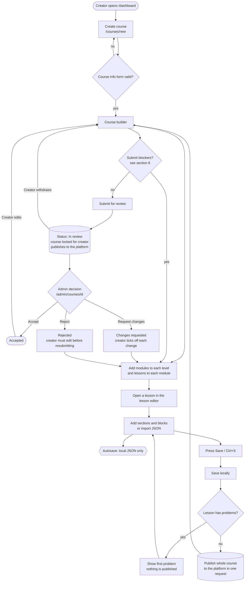
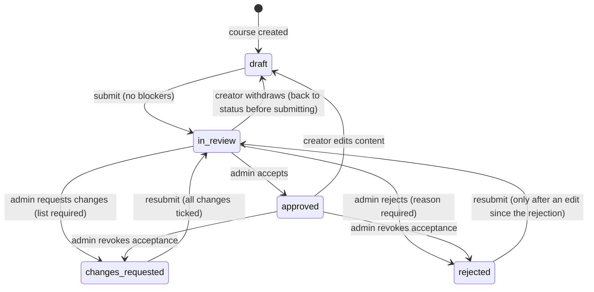
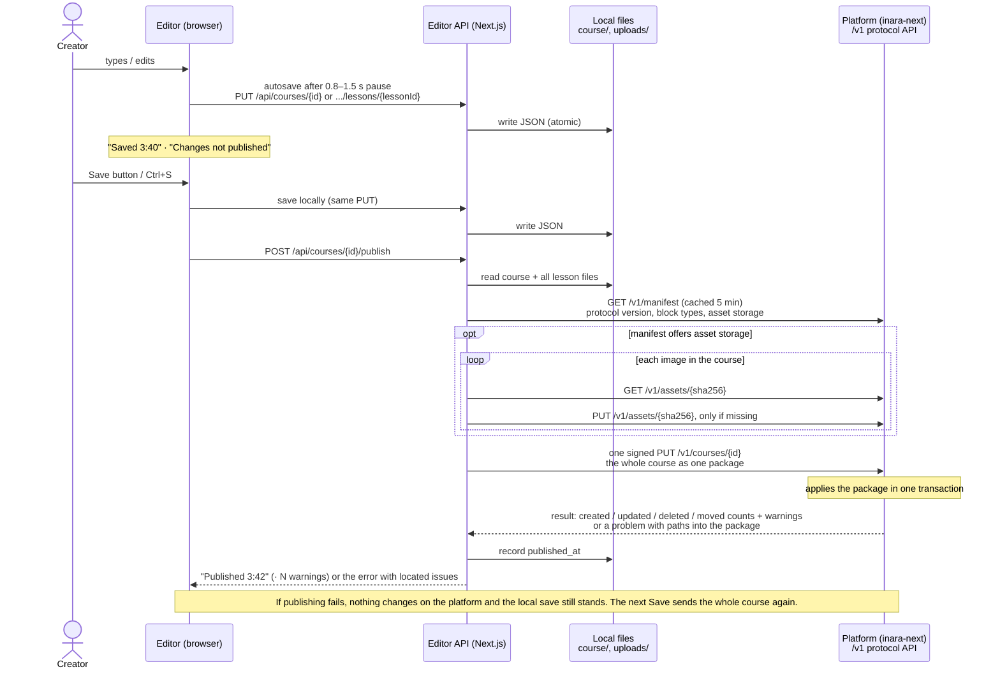

# Inara Course Editor: handover for testing and development

Last updated: 2026-10-05. Branch: `main`.

The Inara Course Editor is a Next.js web app where **creators** build interactive courses and
**admins** review them.

- A course has three fixed levels (Associate, Intermediate, Advanced), modules inside each level,
  and lessons inside each module.
- Lessons are made of sections and blocks: text, images, interactive explore blocks and graded
  questions.
- Work is saved as local JSON files. The **Save** button also publishes the course to the Inara
  platform (inara-next) through the **Course Publishing Protocol**: one signed request with the
  whole course ([contract/README.md](../contract/README.md)). The editor never connects to a database.

The flowcharts below use Mermaid. They render on GitHub and GitLab, and in VS Code with a Mermaid
extension. For how the code fits together (every page, component, API route and module), see
[ARCHITECTURE.md](ARCHITECTURE.md).

---

## 1. Running it

**Requirements:** Node 20.9 or later (Render uses 22).

```bash
npm install
npm run dev        # http://localhost:3000
```

**Environment (`.env.local`):**

| Variable | Needed for | Notes |
|---|---|---|
| `PLATFORM_ADAPTER` | publishing | `protocol`, or `none` (default: Save only saves locally) |
| `PLATFORM_URL` | publishing | The host's protocol base URL. inara-next: `<inara-next URL>/api/integrations/course-editor`. https except for localhost |
| `PLATFORM_KEY_ID`, `PLATFORM_KEY_SECRET` | publishing | The signing key pair shared with the host. The secret is at least 32 characters. See [platform-integration.md](platform-integration.md) |
| `EDITOR_PUBLIC_URL` | publishing images | This editor's public address, for images the host can't store |
| `DATA_DIR` | optional | Folder holding `course/` and `uploads/`. Defaults to the project folder. On Render it's `/var/data`, a persistent disk. |
| `DATABASE_URL`, `SUPABASE_URL`, `SUPABASE_SERVICE_ROLE_KEY` | no longer used | Left over from direct database publishing. Safe to remove from `.env.local`. |

**Deploying:** `render.yaml` is a Render Blueprint. It needs a paid plan (for the persistent disk),
and it sets `PLATFORM_ADAPTER=protocol`. `PLATFORM_URL`, `PLATFORM_KEY_ID`, `PLATFORM_KEY_SECRET`
and `EDITOR_PUBLIC_URL` must be set in the Render dashboard. inara-next needs the same key pair in
`COURSE_EDITOR_KEYS=<id>:<secret>` (and optionally `COURSE_EDITOR_ORGANIZATION_ID`).

---

## 2. Who uses it and where

| Area | URL | Who | What they do |
|---|---|---|---|
| Creator dashboard | `/dashboard` (`/` redirects here) | creators | List their courses, filter by status, create a course, download all courses as a zip |
| New course | `/courses/new` | creators | Course info form (step 1) |
| Course builder | `/courses/[courseId]` | creators | Levels → modules → lessons, review status panel, Save, Download |
| Course settings | `/courses/[courseId]/settings` | creators | Edit the course info form |
| Lesson editor | `/courses/[courseId]/lessons/[lessonId]` | creators | Sections and blocks, JSON import/export, Edit / Preview, Save |
| Course preview | `/courses/[courseId]/preview` (admin: `/admin/courses/[courseId]/preview`) | creators, admins | The course and every lesson as learners see them, rendered with inara-next's player |
| Admin dashboard | `/admin` | admins | All courses, filter by status |
| Admin review page | `/admin/courses/[courseId]` | admins | Read the course, accept / reject / request changes, delete |
| Admin edit | `/admin/courses/[courseId]/edit`, `.../lessons/[lessonId]`, `.../settings` | admins | Edit any course, even while it is in review |

> **Important for testers:** there is **no login**.
> - Everyone is the same creator (`user_local_creator`).
> - Anyone who opens `/admin` gets admin powers. Admin pages send an `x-inara-mode: admin` header, and
>   the server trusts it.
>
> This is a known gap (see section 9), not a bug to report.

---

## 3. Main flow



---

## 4. Review status (state machine)

The rules live in `lib/course-status.ts`, and the API and the UI share them.



| Status | Label in UI | Creator can edit? | Notes |
|---|---|---|---|
| `draft` | Draft | yes | |
| `in_review` | In review | **no** (read-only) | Admins can still edit. Their edits never change the status. |
| `changes_requested` | Changes requested | yes | Every requested change must be ticked off before resubmitting. |
| `approved` | Accepted | yes | Any creator edit moves the course back to Draft. |
| `rejected` | Rejected | yes | Resubmitting is blocked until the course is edited after the rejection. |

---

## 5. Saving and publishing



**When publishing happens:**
- the **Save** button or Ctrl/⌘+S, in the course builder and the lesson editor
- **submit**, **withdraw**, and the admin's **accept / reject / request changes**. If publishing fails
  then, the status change still happens and the panel shows "…but not published to the platform".
- **never** on autosave

**What gets sent to the platform:** one package with the course (title, summary, cover image,
review status and requested changes), its 3 levels, modules, lessons and each saved lesson's
content, all keyed by the editor's UUIDs. The platform keeps the mapping to its own ids, so the
editor keeps no link files. Anything the platform has for the course that the package doesn't list
is removed; moved modules and lessons are moved. Lessons never saved, lessons with validation
errors, and lessons using a block type the platform's manifest doesn't list are sent without
content: the platform keeps their last published version (a new lesson is created empty).

**Deleting** a course in the editor deletes it on the platform first. If that fails, the course is
kept in the editor too, with the error shown.

The protocol is specified in [contract/README.md](../contract/README.md); configuration, the
inara-next status mapping and local testing are in [platform-integration.md](platform-integration.md).

---

## 6. Validation rules (what testers should check)

### Course info form (create and settings)

| Field | Rule |
|---|---|
| Title | 3–120 characters, must contain a real word (not just numbers or symbols), **unique on the platform** (checked at publish) |
| Summary | 20–1000 characters, real words |
| Learning objectives | 1–12 objectives, each 3–200 characters, no duplicates (case-insensitive) |
| Cover image | optional; an `https://` URL or an uploaded file |
| Audience | 3–200 characters, real words |
| Length | 0.5–100 hours |
| Pricing | Free, or Paid with an amount above 0 and a currency (PKR, USD, AED, …) |
| Lesson size | Short / Medium / Long preset, which fills in the limits below |
| Limits | words per lesson (min ≤ max), sections per lesson, minutes per lesson (1–240), reading speed (50–600 wpm), level shares (must add up to 100%), on-target margin (0–100%) |

### Submitting for review (blockers: these stop Submit)

- Two modules share a title anywhere in the course, or two lessons share a title in a module
  (compared case-insensitively). New modules and lessons get free default names ("Module 6").
- A level has no lessons. A level given 0% of the time may stay empty.
- A module has no lessons.
- A lesson hasn't been written yet (no saved content).
- A lesson's word count or section count is outside the course limits.
- A lesson has validation problems.
- Status is Changes requested and some changes aren't ticked off.
- Status is Rejected and nothing has been edited since the rejection.

**Warnings (they don't block):** a level that is under or over its time target by more than the margin.

### Lesson editor

- Every section needs at least one block. Section and block ids must be unique UUIDs.
- Each block type has its own checks (`lib/lesson-validate.ts`). For example, a multiple-choice
  question needs a correct answer, and sequencing must list every item.
- **Fill in the blanks:** each blank needs at least two options (matches inara-next).
- **New Explore blocks** (wheel diagram, nested layers, add the next layer, format switcher, image
  switcher, roadmap): item limits as in [preview.md](preview.md#block-types). Every item needs a
  label and text; images need a URL and alt text; roadmap events need a date, text and an era.
- **Save with problems:** the lesson is saved locally, but **not published**. The Save bar shows
  "Fix N problems to publish" and jumps to the first one.
- **JSON panel:** Copy, Download, **Validate**, Apply to editor. Validation only checks the shape; it
  can't tell whether the AI marked the wrong answer as correct.

### Publishing

**Lessons with errors are skipped, not refused.** The same goes for lessons using a block type the
platform's manifest doesn't list. The rest of the course publishes, the lesson keeps its last
published version on inara-next, and the Save bar shows "Published · N warnings". Hover it to see
which lessons and why.

**Refused with a message.** Nothing changes on the platform. When the platform says where the
problem is, the Save bar tooltip (and the status or decision panel) names the lesson, section and
block.

- Two modules in the course have the same title, even in different levels, or two lessons in a
  module do. inara-next requires unique course titles, module titles unique per course and lesson
  titles unique per module, and answers 409 / 422 with the item at fault.
- Another course on inara-next already uses this title.
- The platform rejects some content (422), naming the lesson, section and block.
- Couldn't reach the platform, or it refuses access (wrong key or clock more than 5 minutes off).
- A creator tries to publish while the course is in review.
- Publishing isn't set up (`PLATFORM_ADAPTER` unset, or a `PLATFORM_*` variable missing or wrong).
  Save then only saves locally, and the message names the variable.

### Uploads

- Images only: PNG, JPEG, GIF, WebP, AVIF. **SVG is refused** on purpose, because it can carry scripts.
- Maximum 5 MB.
- Stored in `uploads/<uuid>.<ext>` and served from `/uploads/<file>`.

---

## 7. Test checklist

Each row is a scenario and the expected result.

**Course creation and builder**
- [ ] Create a course with every field valid → lands in the builder with 3 empty levels.
- [ ] Each form field rejects bad input with the message from section 6 (e.g. title "12345", duplicate objectives, level shares adding up to 90%).
- [ ] Add, rename, reorder and delete modules and lessons → autosaves ("Saved hh:mm"); a reload keeps the changes.
- [ ] Delete a module with lessons → asks for confirmation and deletes the lesson files too.
- [ ] Open the same course in two tabs and edit both → the second tab's save fails with "changed elsewhere, reload".
- [ ] Level tabs show planned vs target minutes and turn under / ok / over correctly.

**Lesson editor**
- [ ] Add every block type (Content, Explore, Assess); fill it in → no issues; Save → "Published hh:mm".
- [ ] Leave a block invalid → the issue count shows; Save saves locally but shows "Fix N problems to publish".
- [ ] Image hotspot: click the image to add a pin, reposition it, delete it.
- [ ] JSON panel: Validate bad JSON → a list of problems; valid JSON → Apply to editor replaces the lesson.
- [ ] Leave with unsaved changes → the browser warns you.

**Review workflow**
- [ ] Submit with blockers → refused with the list; without blockers → In review, and the course and lessons become read-only.
- [ ] Withdraw → back to the previous status.
- [ ] Admin rejects without a reason → refused. With a reason → Rejected; the creator sees the feedback.
- [ ] Resubmit a rejected course without editing → blocked. After an edit → allowed.
- [ ] Admin requests changes (with targets) → the creator sees each change linked to its lesson and must tick all of them before resubmitting.
- [ ] Admin accepts → Accepted. The creator edits → back to Draft ("Edited after acceptance").
- [ ] Admin revokes an acceptance → Changes requested or Rejected.
- [ ] Admin edits a course in review → allowed; the status is unchanged.

**Publishing (check in inara-next's admin, e.g. `/admin`)**

Set up local inara-next first: [platform-integration.md § 3, Local testing](platform-integration.md#local-testing).
- [ ] Run `npm run verify-host` against local inara-next → all checks pass.
- [ ] Save → the course, its 3 levels, modules, lessons and lesson content appear on inara-next.
- [ ] Save again with no changes → nothing changes on inara-next and no duplicates appear.
- [ ] Rename, reorder, move or delete modules and lessons, then Save → inara-next matches.
- [ ] Each workflow action → course and lesson statuses follow the mapping table in platform-integration.md.
- [ ] Same module title in two levels → shown as an error in the builder; publishing is refused, naming it.
- [ ] A lesson with a validation error (e.g. hotspot block with no pins) → Save → "Published · 1 warning" naming that lesson; other lessons arrive.
- [ ] Approve a course, then move one of its lessons to another module → it moves on inara-next and learner progress stays.
- [ ] Delete a course in the editor → it's gone from inara-next too.
- [ ] Stop inara-next and press Save → the local save works and the publish shows "Couldn't reach the platform".
- [ ] Image in a lesson, inara-next without Firebase, `EDITOR_PUBLIC_URL` set → "Published · 1 warning"; the image on inara-next points at `EDITOR_PUBLIC_URL/uploads/…`.

**Preview** ([preview.md](preview.md))
- [ ] Lesson editor → Preview → the lesson shows in inara-next's style; Continue, answering questions and points work; Edit returns with nothing lost, including unsaved changes.
- [ ] Builder → Preview → saves, then shows the overview (cover, facts, objectives, content); every lesson opens from the outline and with previous/next.
- [ ] A lesson that isn't written → "hasn't been written yet"; an invalid lesson → its problems listed by field.
- [ ] A lesson containing a block the editor can't author (e.g. `wheel_diagram` via JSON import) → renders in the preview.
- [ ] Admin review page → Preview as learner → same preview, Back to editing returns to the review page.

**Downloads and uploads**
- [ ] Course Download → a zip containing `course/<id>/course.json`, the lesson files and the images used.
- [ ] Dashboard "Download all" → a zip of every course.
- [ ] Upload an SVG or a file over 5 MB → refused.

---

## 8. For developers

### Code map

| Path | What it is |
|---|---|
| `app/` | Pages (creator, admin) and API routes (`app/api/...`) |
| `components/course/` | Course builder, info form, status panel, level tabs |
| `components/lesson-editor/` | Lesson editor, block editors (`blocks/`), JSON panel, Save bar, `use-publish.ts` |
| `components/admin/` | Admin decision panel, delete button |
| `components/tiptap-*` | Rich-text editor (Tiptap template code) |
| `lib/course.ts` | Course schema (zod), levels, limits, presets |
| `lib/lesson.ts`, `lib/lesson-validate.ts` | Lesson model, block catalog, lesson validation |
| `lib/course-validate.ts` | Lesson stats, level budgets, submit blockers |
| `lib/course-status.ts` | Review state machine |
| `lib/course-store.ts` | Reads and writes local JSON (atomic writes, writes queued per course, revision check) |
| `lib/platform/` | Publishing: `PlatformPort` interface (`publishCourse`, `deleteCourse`), signing HTTP client, protocol adapter (`adapters/protocol/`) |
| `lib/protocol/` | The Course Publishing Protocol: `wire.ts` (messages, zod) and `signing.ts` (HMAC request signing) |
| `contract/` | The protocol spec for hosts: `README.md`, `openapi.yaml`, generated JSON Schemas, test fixtures |
| `tests/` | Vitest unit tests (signing, package building, the adapter against an in-memory host, env checks) |
| `lib/course-export.ts` | Zip downloads |
| `lib/auth.ts`, `lib/admin-mode.ts` | Placeholder "current user" and admin mode |
| `json-guide/` | Lesson format reference and AI prompt for writing lessons in JSON |
| `db/migrations/` | SQL for inara-next's status enums, which inara-next's schema already includes (reference only) |
| `docs/platform-integration.md` | Publishing in detail, connecting to inara-next, and local testing |

### API endpoints

| Method and path | Purpose |
|---|---|
| `GET/POST /api/courses` | list / create courses |
| `GET/PUT/DELETE /api/courses/[id]` | read / autosave / delete a course (DELETE deletes it on the platform first; if that fails the course is kept) |
| `GET/PUT/DELETE /api/courses/[id]/lessons/[lessonId]` | read / autosave / delete lesson content |
| `POST /api/courses/[id]/publish` | publish to the platform (the Save button) |
| `POST /api/courses/[id]/submit`, `/withdraw` | creator workflow (also publishes) |
| `POST /api/courses/[id]/review` | admin decision (also publishes) |
| `PATCH /api/courses/[id]/changes/[changeId]` | tick off a requested change or add a note |
| `GET /api/courses/[id]/export`, `GET /api/export` | zip downloads |
| `POST /api/uploads`, `GET /uploads/[file]` | image upload / serving |

### Database migrations (`db/migrations/`)

The editor no longer touches a database. These files hold the SQL for status values in inara-next's
enums (first added to the Supabase database). inara-next's Prisma schema already includes them
(commit `3991c573`), so nothing needs to be run for the editor; they are kept for reference. The
platform team manages its databases through Alembic.

| File | Content |
|---|---|
| `001_changes_requested_status.sql` | Adds `CHANGES_REQUESTED` to `generated_lesson_status` |
| `002_course_status_review_values.sql` | Adds `UNDER_REVIEW`, `CHANGES_REQUESTED`, `APPROVED`, `REJECTED` to `course_status` |
| `002_course_review_status.sql` | **Unused**, an alternative design (a separate `review_status` column). Never run. Delete it or keep it on purpose. |

### Checks

```bash
npm test                 # Vitest unit tests in tests/
npm run typecheck        # tsc --noEmit
npm run contract:check   # contract/schemas match lib/protocol/wire.ts
npm run verify-host      # protocol conformance against a running host (uses the PLATFORM_* variables;
                         # creates and deletes a test course, so use a development host)
npm run build            # passes
npx eslint .       # errors only in the Tiptap template code and hooks/ (React Compiler rules), not the editor's own code
```

---

## 9. Known issues and open items

| # | Item | Impact |
|---|---|---|
| 1 | **No authentication.** One shared creator; `/admin` is open to anyone; admin mode is a header. The signing key only identifies the editor installation, not the user. | Must be fixed before real users. Next phase: sign-in through a launch token issued by the host platform (inara-next), so authors use their host account and the host decides who may publish. No Clerk in the editor. |
| 2 | **Lesson rules are duplicated** between the editor and inara-next. They match today (all 16 authored block types compared), and lessons with errors are never sent. | If inara-next adds a rule, update `lib/lesson-validate.ts` too. Until then inara-next refuses the content and the editor shows where. |
| 3 | **Existing courses may have duplicate module titles** (e.g. "hello"). | The builder flags them; rename before publishing. |
| 4 | **Images** are copied to the platform only when the host's manifest offers asset storage (inara-next: when its Firebase storage is configured) and accepts the type and size. | Otherwise they link to `EDITOR_PUBLIC_URL`, which must stay reachable. The publish warns. |
| 5 | **Content added in inara-next to an editor course** (modules or lessons created in inara-next's admin) is removed on the next publish: the editor is the source of truth. | The publish warns when a removed lesson had learner completions. |
| 6 | **Two separate editor installations publishing the same course** could overwrite each other: revision ordering is per editor process, and inara-next doesn't store the revision yet. | Publish each course from one installation. |
| 7 | Course data (`course/`) is tracked in git, so editing in the app creates git changes. | |
| 8 | The lesson editor authors 16 of the platform's 17 block types; `workplace_scenario` is platform-generated and shown read-only. | |

**Resolved since 2026-10-01** (by the move to the Course Publishing Protocol): moving lessons and
modules now moves them on inara-next, keeping learner progress, instead of being refused; a publish
is one transaction instead of many API calls; deleting a course in the editor deletes it on
inara-next; unit tests exist (`npm test`).
