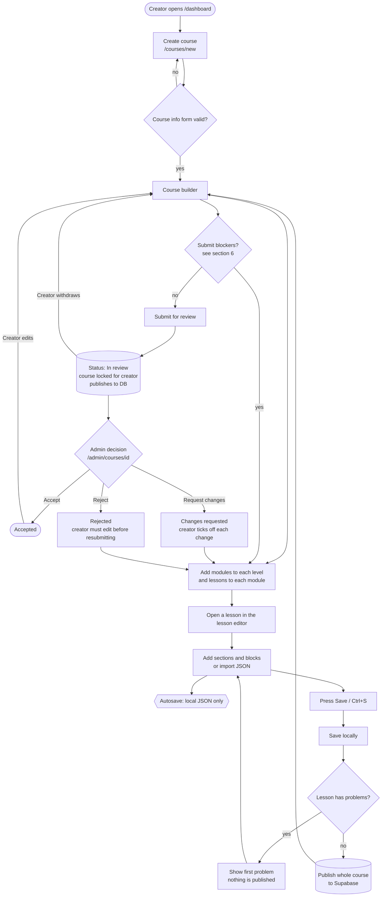
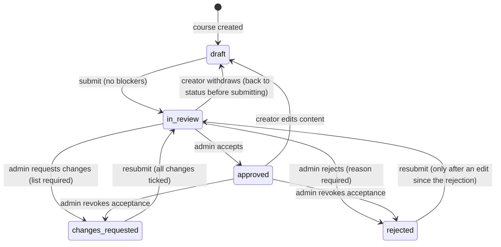
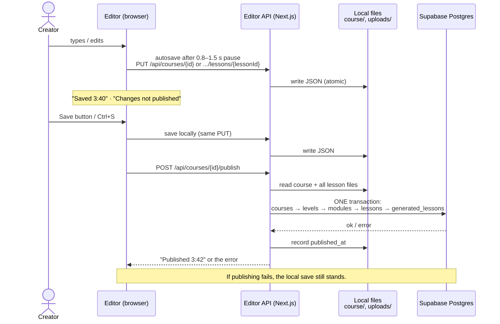

# Inara Course Editor: handover for testing and development

Last updated: 2026-10-01. Branch: `main`.

The Inara Course Editor is a Next.js web app where **creators** build interactive courses and
**admins** review them.

- A course has three fixed levels (Associate, Intermediate, Advanced), modules inside each level,
  and lessons inside each module.
- Lessons are made of sections and blocks: text, images, interactive explore blocks and graded
  questions.
- Work is saved as local JSON files. The **Save** button also publishes the course to the Inara
  platform's Supabase (Postgres) database.

The flowcharts below use Mermaid. They render on GitHub and GitLab, and in VS Code with a Mermaid
extension. For how the code fits together (every page, component, API route and module), see
[ARCHITECTURE.md](ARCHITECTURE.md).

---

## 1. Running it

**Requirements:** Node 20.9 or later (Render uses 22).

```bash
npm install
npm run dev        # http://localhost:3000
```

**Environment (`.env.local`):**

| Variable | Needed for | Notes |
|---|---|---|
| `DATABASE_URL` | publishing to the database | Supabase **Session pooler** URI. Without it, Save still saves locally but publishing fails with a clear error. |
| `DATA_DIR` | optional | Folder holding `course/` and `uploads/`. Defaults to the project folder. On Render it's `/var/data`, a persistent disk. |
| `SUPABASE_URL`, `SUPABASE_SERVICE_ROLE_KEY` | not used by the code | Present in `.env.local`. Safe to remove. |

**Deploying:** `render.yaml` is a Render Blueprint. It needs a paid plan (for the persistent disk),
and `DATABASE_URL` must be set in the Render dashboard.

---

## 2. Who uses it and where

| Area | URL | Who | What they do |
|---|---|---|---|
| Creator dashboard | `/dashboard` (`/` redirects here) | creators | List their courses, filter by status, create a course, download all courses as a zip |
| New course | `/courses/new` | creators | Course info form (step 1) |
| Course builder | `/courses/[courseId]` | creators | Levels → modules → lessons, review status panel, Save, Download |
| Course settings | `/courses/[courseId]/settings` | creators | Edit the course info form |
| Lesson editor | `/courses/[courseId]/lessons/[lessonId]` | creators | Sections and blocks, JSON import/export, Save |
| Admin dashboard | `/admin` | admins | All courses, filter by status |
| Admin review page | `/admin/courses/[courseId]` | admins | Read the course, accept / reject / request changes, delete |
| Admin edit | `/admin/courses/[courseId]/edit`, `.../lessons/[lessonId]`, `.../settings` | admins | Edit any course, even while it is in review |

> **Important for testers:** there is **no login**.
> - Everyone is the same creator (`user_local_creator`).
> - Anyone who opens `/admin` gets admin powers. Admin pages send an `x-inara-mode: admin` header, and
>   the server trusts it.
>
> This is a known gap (see section 9), not a bug to report.

---

## 3. Main flow



---

## 4. Review status (state machine)

The rules live in `lib/course-status.ts`, and the API and the UI share them.



| Status | Label in UI | Creator can edit? | Notes |
|---|---|---|---|
| `draft` | Draft | yes | |
| `in_review` | In review | **no** (read-only) | Admins can still edit. Their edits never change the status. |
| `changes_requested` | Changes requested | yes | Every requested change must be ticked off before resubmitting. |
| `approved` | Accepted | yes | Any creator edit moves the course back to Draft. |
| `rejected` | Rejected | yes | Resubmitting is blocked until the course is edited after the rejection. |

---

## 5. Saving and publishing



**When publishing happens:**
- the **Save** button or Ctrl/⌘+S, in the course builder and the lesson editor
- **submit**, **withdraw**, and the admin's **accept / reject / request changes**. If publishing fails
  then, the status change still happens and the panel shows "…but not published to the platform".
- **never** on autosave

**What gets written to the database:**

| Table | Matched on | Written |
|---|---|---|
| `courses` | `uuid` = editor course id | title, description (summary), cover_image_url, status, created_at, updated_at |
| `levels` | course + `level_number` (1–3) | name: Associate / Intermediate / Advanced |
| `modules` | `uuid` = editor module id | title, course_id, level_id, order_index (0-based within the level) |
| `lessons` | `uuid` = editor lesson id | title, module_id, order_index (0-based within the module) |
| `generated_lessons` | lesson + language `English` | structured_content (lesson JSON), generated_text (plain text), word_count, title, status, approved_by / approved_at, rejected_by / rejection_comments, is_canonical=true |

- Modules and lessons deleted in the editor are **deleted** from the database.
- Lessons that have never been saved get a `lessons` row but **no** `generated_lessons` row.

**Status mapping:**

| Editor | `courses.status` | `generated_lessons.status` |
|---|---|---|
| draft | DRAFT | DRAFT |
| in_review | UNDER_REVIEW | UNDER_REVIEW |
| changes_requested | CHANGES_REQUESTED | CHANGES_REQUESTED |
| approved | APPROVED | APPROVED |
| rejected | REJECTED | REJECTED |

The editor never sets `PUBLISHED` or `RETIRED`. A course already in either state keeps it.

---

## 6. Validation rules (what testers should check)

### Course info form (create and settings)

| Field | Rule |
|---|---|
| Title | 3–120 characters, must contain a real word (not just numbers or symbols), **unique on the platform** (checked at publish) |
| Summary | 20–1000 characters, real words |
| Learning objectives | 1–12 objectives, each 3–200 characters, no duplicates (case-insensitive) |
| Cover image | optional; an `https://` URL or an uploaded file |
| Audience | 3–200 characters, real words |
| Length | 0.5–100 hours |
| Pricing | Free, or Paid with an amount above 0 and a currency (PKR, USD, AED, …) |
| Lesson size | Short / Medium / Long preset, which fills in the limits below |
| Limits | words per lesson (min ≤ max), sections per lesson, minutes per lesson (1–240), reading speed (50–600 wpm), level shares (must add up to 100%), on-target margin (0–100%) |

### Submitting for review (blockers: these stop Submit)

- A level has no lessons. A level given 0% of the time may stay empty.
- A module has no lessons.
- A lesson hasn't been written yet (no saved content).
- A lesson's word count or section count is outside the course limits.
- A lesson has validation problems.
- Status is Changes requested and some changes aren't ticked off.
- Status is Rejected and nothing has been edited since the rejection.

**Warnings (they don't block):** a level that is under or over its time target by more than the margin.

### Lesson editor

- Every section needs at least one block. Section and block ids must be unique UUIDs.
- Each block type has its own checks (`lib/lesson-validate.ts`). For example, a multiple-choice
  question needs a correct answer, and sequencing must list every item.
- **Save with problems:** the lesson is saved locally, but **not published**. The Save bar shows
  "Fix N problems to publish" and jumps to the first one.
- **JSON panel:** Copy, Download, **Validate**, Apply to editor. Validation only checks the shape; it
  can't tell whether the AI marked the wrong answer as correct.

### Publishing (refused with a message)

- Two lessons in the same module have the same title.
- Another course on the platform already uses this title.
- The database is missing a status value. The message names the migration to run.
- A creator tries to publish while the course is in review.

### Uploads

- Images only: PNG, JPEG, GIF, WebP, AVIF. **SVG is refused** on purpose, because it can carry scripts.
- Maximum 5 MB.
- Stored in `uploads/<uuid>.<ext>` and served from `/uploads/<file>`.

---

## 7. Test checklist

Each row is a scenario and the expected result.

**Course creation and builder**
- [ ] Create a course with every field valid → lands in the builder with 3 empty levels.
- [ ] Each form field rejects bad input with the message from section 6 (e.g. title "12345", duplicate objectives, level shares adding up to 90%).
- [ ] Add, rename, reorder and delete modules and lessons → autosaves ("Saved hh:mm"); a reload keeps the changes.
- [ ] Delete a module with lessons → asks for confirmation and deletes the lesson files too.
- [ ] Open the same course in two tabs and edit both → the second tab's save fails with "changed elsewhere, reload".
- [ ] Level tabs show planned vs target minutes and turn under / ok / over correctly.

**Lesson editor**
- [ ] Add every block type (Content, Explore, Assess); fill it in → no issues; Save → "Published hh:mm".
- [ ] Leave a block invalid → the issue count shows; Save saves locally but shows "Fix N problems to publish".
- [ ] Image hotspot: click the image to add a pin, reposition it, delete it.
- [ ] JSON panel: Validate bad JSON → a list of problems; valid JSON → Apply to editor replaces the lesson.
- [ ] Leave with unsaved changes → the browser warns you.

**Review workflow**
- [ ] Submit with blockers → refused with the list; without blockers → In review, and the course and lessons become read-only.
- [ ] Withdraw → back to the previous status.
- [ ] Admin rejects without a reason → refused. With a reason → Rejected; the creator sees the feedback.
- [ ] Resubmit a rejected course without editing → blocked. After an edit → allowed.
- [ ] Admin requests changes (with targets) → the creator sees each change linked to its lesson and must tick all of them before resubmitting.
- [ ] Admin accepts → Accepted. The creator edits → back to Draft ("Edited after acceptance").
- [ ] Admin revokes an acceptance → Changes requested or Rejected.
- [ ] Admin edits a course in review → allowed; the status is unchanged.

**Publishing (check in Supabase → Table Editor)**
- [ ] Save → `courses`, `levels` (3), `modules`, `lessons` and `generated_lessons` rows appear with the values from section 5.
- [ ] Save again with no changes → no duplicate rows.
- [ ] Delete a lesson or module and Save → its rows are gone.
- [ ] Each workflow action → `courses.status` and `generated_lessons.status` follow the mapping table.
- [ ] Duplicate lesson title in a module → the publish is refused with a message naming it.
- [ ] Wrong or missing `DATABASE_URL` → the local save works and the publish shows an error.

**Downloads and uploads**
- [ ] Course Download → a zip containing `course/<id>/course.json`, the lesson files and the images used.
- [ ] Dashboard "Download all" → a zip of every course.
- [ ] Upload an SVG or a file over 5 MB → refused.

---

## 8. For developers

### Code map

| Path | What it is |
|---|---|
| `app/` | Pages (creator, admin) and API routes (`app/api/...`) |
| `components/course/` | Course builder, info form, status panel, level tabs |
| `components/lesson-editor/` | Lesson editor, block editors (`blocks/`), JSON panel, Save bar, `use-publish.ts` |
| `components/admin/` | Admin decision panel, delete button |
| `components/tiptap-*` | Rich-text editor (Tiptap template code) |
| `lib/course.ts` | Course schema (zod), levels, limits, presets |
| `lib/lesson.ts`, `lib/lesson-validate.ts` | Lesson model, block catalog, lesson validation |
| `lib/course-validate.ts` | Lesson stats, level budgets, submit blockers |
| `lib/course-status.ts` | Review state machine |
| `lib/course-store.ts` | Reads and writes local JSON (atomic writes, writes queued per course, revision check) |
| `lib/course-publish.ts`, `lib/db.ts` | Publishing to Postgres |
| `lib/course-export.ts` | Zip downloads |
| `lib/auth.ts`, `lib/admin-mode.ts` | Placeholder "current user" and admin mode |
| `json-guide/` | Lesson format reference and AI prompt for writing lessons in JSON |
| `db/migrations/` | SQL run on the Supabase database |
| `docs/database-publishing.md` | Publishing in more detail |

### API endpoints

| Method and path | Purpose |
|---|---|
| `GET/POST /api/courses` | list / create courses |
| `GET/PUT/DELETE /api/courses/[id]` | read / autosave / delete a course |
| `GET/PUT/DELETE /api/courses/[id]/lessons/[lessonId]` | read / autosave / delete lesson content |
| `POST /api/courses/[id]/publish` | publish to the database (the Save button) |
| `POST /api/courses/[id]/submit`, `/withdraw` | creator workflow (also publishes) |
| `POST /api/courses/[id]/review` | admin decision (also publishes) |
| `PATCH /api/courses/[id]/changes/[changeId]` | tick off a requested change or add a note |
| `GET /api/courses/[id]/export`, `GET /api/export` | zip downloads |
| `POST /api/uploads`, `GET /uploads/[file]` | image upload / serving |

### Database migrations (`db/migrations/`)

| File | State |
|---|---|
| `001_changes_requested_status.sql` | **Run on Supabase.** Adds `CHANGES_REQUESTED` to `generated_lesson_status`. |
| `002_course_status_review_values.sql` | **Run on Supabase.** Adds `UNDER_REVIEW`, `CHANGES_REQUESTED`, `APPROVED`, `REJECTED` to `course_status`. |
| `002_course_review_status.sql` | **Not run and not used by the code.** An alternative design (a separate `review_status` column). Delete it or keep it on purpose; it also shares the `002` number. |

### Checks

```bash
npx tsc --noEmit   # passes
npm run build      # passes
npx eslint .       # errors only in the Tiptap template code and hooks/ (React Compiler rules), not the editor's own code
```

---

## 9. Known issues and open items

| # | Item | Impact |
|---|---|---|
| 1 | **No authentication.** One shared creator; `/admin` is open to anyone; admin mode is a header. | Must be fixed before real users. Planned: Clerk, using the same app as inara-next. |
| 2 | **Writes directly to the platform database.** The planned move to calling inara-next's API (one adapter, Clerk session forwarding) **hasn't been built**. | The editor duplicates platform rules (title uniqueness, deletes), and doesn't create the `course_organizations` link, so its courses may not show in inara-next. |
| 3 | **New enum values vs inara-next.** inara-next's `prisma/schema.prisma` was updated (uncommitted, branch `local-dev-auth`), with a learner-access fix in `enroll-level` / `unlock-level`. Other environments still need the values added via Alembic. | Without that, inara-next can error when it reads these courses. |
| 4 | **Module titles must be unique per course** in the production schema (across all levels). The editor doesn't check this; it defaults every module to "Module 1", "Module 2"… in each level. | Publishing will fail on the real schema. |
| 5 | **The dev Supabase database has no primary keys, unique constraints or foreign keys.** | Dev doesn't behave like production. |
| 6 | **Images are stored on the editor's own disk.** `cover_image_url` and lesson image URLs point at the editor's host, not Firebase / Supabase Storage. | Images break if the editor host changes. |
| 7 | Only English is published. `key_concepts` and `lesson_type` aren't set. | |
| 8 | Course data (`course/`) is tracked in git, so editing in the app creates git changes. | |
| 9 | No automated tests. | |
| 10 | The lesson editor supports 10 block types; the platform supports 16 (e.g. `wheel_diagram`, `vertical_roadmap`). Unknown blocks are shown read-only and kept unchanged. | |
