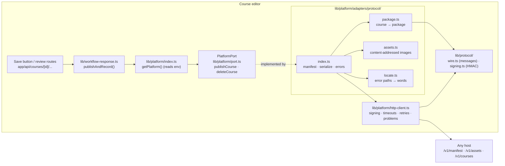

# Platform integration (publishing)

Last updated: 2026-10-05. Replaces the inara-next admin-API adapter (kept in git history on the
`wip/clerk-publish` branch).

The editor publishes courses through the **Course Publishing Protocol**, which the editor owns and
any host platform implements: [contract/README.md](../contract/README.md) is the spec. The editor
contains **no host-specific code**: no host URLs, ids, enums, rules or login. inara-next is one
host; a FastAPI service could be another, with no change to the editor.

- **Autosave** writes only the editor's local JSON files.
- **Save** (or Ctrl/⌘+S) saves locally, then publishes the whole course in **one signed request**.
  The host applies it in **one transaction**: a publish happens completely or not at all.
- **Review actions** (submit, withdraw, accept / reject / request changes) publish the new status.
- **Deleting** a course deletes it on the host first; if that fails, the course stays in the editor.
- If publishing fails, the local save still stands, and the Save bar or status panel shows why,
  down to the lesson, section and block when the host says where the problem is.

---

## 1. Design



- **The editor depends only on `PlatformPort`.** Nothing outside `lib/platform/` knows publishing
  exists beyond `publishCourse` and `deleteCourse`.
- **The protocol is the contract, not a host's API.** `lib/protocol/wire.ts` defines every
  message; `contract/schemas/*.schema.json` are generated from it (`npm run contract:generate`,
  checked by `npm run contract:check`) for hosts in other languages.
- **One request per publish.** The package carries the whole course (structure, content, review
  status) keyed by the editor's UUIDs. The host keeps the mapping to its own ids, so the editor keeps
  **no link files** and can't create duplicates by losing one.
- **Images are content-addressed** (id = SHA-256 of the bytes). The editor asks the host whether it
  has an image and uploads it only if not. Hosts without file storage say so in their manifest and
  the editor links images from `EDITOR_PUBLIC_URL`.
- **The host negotiates.** `GET /v1/manifest` says which protocol major it speaks, which block types
  it can show (lessons using others keep their last published version, with a warning), and its
  limits. It is cached for five minutes.
- **One publish per course at a time**, in order, so an older version can never land after a newer
  one.
- **Errors come back as problems** (RFC 9457) with a `code` and paths into the package; the adapter
  turns them into the editor's own kinds (`invalid`, `conflict`, `auth`, `unavailable`,
  `not_configured`) and readable issues ("Lesson “Intro” in module “Basics”, section 2, block 1
  (mcq): …").

### Authentication

Requests are signed with HMAC-SHA256 over the timestamp, method, path and body hash
(`X-Editor-Key-Id`, `X-Editor-Timestamp`, `X-Editor-Signature`; details in the contract). The key
pair is shared with the host. To rotate: add the new key on the host (hosts accept several), switch
the editor's `PLATFORM_KEY_ID` / `PLATFORM_KEY_SECRET`, then remove the old key from the host.

The key identifies **the editor installation**. The package's `actor` is the editor user who pressed
Save, recorded by the host for audit. Signing in to the editor with the host's accounts (a
host-issued launch token) is the next phase; until then `/admin` in the editor is still open, as
before (see HANDOVER known issues).

---

## 2. Configuration

Put these in `.env.local` (see `.env.example`):

| Variable | Meaning |
|---|---|
| `PLATFORM_ADAPTER` | `protocol` to publish, `none` (default) to only save locally |
| `PLATFORM_URL` | The host's protocol base URL. inara-next: `<inara-next URL>/api/integrations/course-editor`. Must be https except for localhost |
| `PLATFORM_KEY_ID` | Id of the signing key |
| `PLATFORM_KEY_SECRET` | The signing secret, at least 32 characters (`openssl rand -base64 36`) |
| `EDITOR_PUBLIC_URL` | This editor's public address, for images the host can't store |

Wrong or missing settings make Save answer "publishing isn't set up" with the exact variable at
fault, never a crash.

---

## 3. Connecting to inara-next

inara-next implements the protocol in `app/api/integrations/course-editor/v1/` and
`lib/integrations/course-editor/` (its `docs/course-editor-integration.md` has the details). On the
inara-next side set:

```
COURSE_EDITOR_KEYS=<PLATFORM_KEY_ID>:<PLATFORM_KEY_SECRET>   # several pairs, comma-separated, for rotation
COURSE_EDITOR_ORGANIZATION_ID=<org id>                       # optional; default: the inaraX organization
```

How inara-next maps a package (for reference; the editor doesn't depend on it):

| Editor | inara-next |
|---|---|
| course / module / lesson UUID | `courses.uuid` / `modules.uuid` / `lessons.uuid` (same value) |
| level 1–3 | `levels.level_number` 1–3 |
| lesson content | the English canonical `generated_lessons.structured_content` |
| `draft` / `in_review` / `changes_requested` / `approved` / `rejected` | course `DRAFT` / `UNDER_REVIEW` / `CHANGES_REQUESTED` / `APPROVED` / `REJECTED`; lessons `DRAFT` / `PENDING_REVIEW` / `REJECTED` (with comments) / `APPROVED` / `REJECTED` |
| — | `PUBLISHED` and `RETIRED` are set in inara-next only and never overwritten |

Moving a lesson or module now **moves** it on inara-next (learner progress stays), instead of the
old delete-and-recreate.

### Local testing

1. In inara-next's `.env`, add `COURSE_EDITOR_KEYS=editor-local:<secret>` and run it
   (`npm run dev`, port 3000).
2. In the editor's `.env.local`:
   ```
   PLATFORM_ADAPTER=protocol
   PLATFORM_URL=http://localhost:3000/api/integrations/course-editor
   PLATFORM_KEY_ID=editor-local
   PLATFORM_KEY_SECRET=<secret>
   ```
3. `npm run dev -- -p 3001`, open a course and press Save. The Save bar links nothing yet, but the
   publish response carries the course's inara-next admin URL.

### Checking a host

`npm run verify-host` runs the protocol's conformance checks (auth, manifest, assets, create,
idempotency, moves, title swaps, removal, validation errors, rollback, delete) against a running host
with the same three `PLATFORM_*` variables. Use a development host: it creates and deletes a test
course.

---

## 4. Tests

`npm test` runs the unit tests:

- `tests/protocol/signing.test.ts`: signing, tampering, clock skew, rotation, and the published test
  vectors.
- `tests/platform/package.test.ts`: building packages, unsupported blocks, locating errors.
- `tests/platform/protocol-adapter.test.ts`: the adapter against an in-memory host
  (`tests/helpers/fake-host.ts`) that verifies signatures like a real one.
- `tests/platform/env.test.ts`: configuration checks.

---

## 5. Known gaps

- **Editor sign-in** still isn't there (next phase: a launch token issued by the host, so authors use
  their host account and the host decides who may publish).
- **Preview** still uses the copied inara-next player in `vendor/inara-player/` (later phase: the
  host renders previews; the copy stays as an offline fallback). The protocol already has a
  `capabilities.preview` flag for it.
- **Revision ordering** is enforced by the editor (one publish per course at a time). The package
  carries `revision`; inara-next doesn't store it yet, so two separate editor installations
  publishing the same course could still overwrite each other.
- **Content added in inara-next to an editor course** (modules or lessons created in inara-next's
  admin) is removed on the next publish: the editor is the source of truth for its courses. The
  publish result warns when a removed lesson had learner completions.
