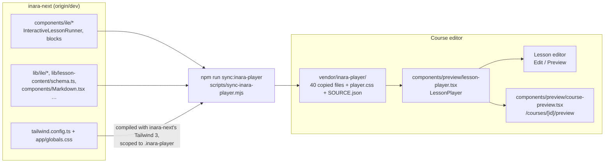

# Course and lesson preview

Last updated: 2026-10-02.

The editor shows lessons and whole courses **as learners see them on inara-next**. It renders them
with inara-next's own learner lesson player, copied into `vendor/inara-player/`.

- **Lesson editor:** the **Edit / Preview** switch in the top bar shows the current lesson,
  including unsaved edits. Switching back to Edit keeps everything as it was.
- **Course builder:** the **Preview** button saves, then opens the course preview.
- **Admin review page:** **Preview as learner** opens the same preview.
- **Course preview** (`/courses/[id]/preview`, `/admin/courses/[id]/preview`): a course overview
  (cover, summary, facts, objectives, content by level), then every lesson in learner order with
  previous/next buttons and an outline. `?lesson=<id>` opens a lesson directly. It shows what's saved
  locally.

Everything in the player works: section steps, **Continue**, answering questions with points and
explanations, and every block type, including the ones the editor can't author yet. Nothing is
published or recorded. Progress lives in session storage under a throwaway id and is cleared when
the preview closes.

A lesson that inara-next would refuse isn't rendered. The preview lists its problems instead, by
field (e.g. `sections.0.blocks.1.data.buckets.0.label: String must contain at least 1 character(s)`),
checked with **inara-next's own schema**.

---

## How it fits together



- **`LessonPlayer`** is the editor's only entry point to the copied code. It mirrors inara-next's
  admin preview: it validates with inara-next's schema, then renders
  `LessonProgressProvider` → `InteractiveLessonRunner` in inara-next's lesson column, with
  `persistPoints={false}`, so it makes no network calls.
- **Styling:** `player.css` is compiled by inara-next's own Tailwind 3 with its own theme, plus the
  lesson styles and CSS variables from its `globals.css`. Every rule is scoped under `.inara-player`,
  so it can't change the editor's UI. The editor's Tailwind 4 skips `vendor/` (`@source not` in
  `app/globals.css`).
- **The copy is never edited by hand.** ESLint ignores it, and each file starts with `@ts-nocheck`
  and a header naming its source commit.

## Updating the player when inara-next changes

```bash
cd ~/Projects/inara-next && git fetch origin dev        # get the latest dev
cd ~/Projects/atomcamp/inara-course-editor/my-app
npm run sync:inara-player -- --from ~/Projects/inara-next --ref origin/dev
```

- **`--ref`** copies from that git ref without touching inara-next's checked-out branch. Leave it out
  to copy the working tree.
- **The script follows imports** from the player's entry files, so new files that inara-next's
  player starts using are picked up automatically.
- **It rewrites only two things:** `@/…` imports become `@/vendor/inara-player/…`, and `zod`
  becomes `zod/v3`. inara-next uses zod 3; the editor's zod 4 ships the v3 API.
- **`vendor/inara-player/SOURCE.json`** records the commit, the copied files and the npm packages
  they need.
- **It warns** when the editor is missing a package or has a different major version. Install
  missing ones with the version it prints.
- **Afterwards:** run `npx tsc --noEmit` and `npm run build`, open a course preview, and commit
  `vendor/inara-player/` along with any `package.json` change.

Current copy: inara-next `origin/dev` @ `85883f1f` (2026-10-02). The editor's `lucide-react` (1.x) is
newer than inara-next's (0.462); every icon the player uses was checked to exist.

**Packages the player needs** (installed): `@dnd-kit/core`, `@dnd-kit/sortable`,
`@dnd-kit/utilities`, `react-markdown`, `remark-gfm`, `remark-math`, `remark-directive`,
`rehype-katex`, `katex`, `mermaid`, `unist-util-visit`, `@types/unist`.

`next.config.ts` sets `images.unoptimized: true`, as inara-next does, because the player shows
author images from any host with `next/image`.

---

## Block types

inara-next `dev` supports 17 block types. The preview renders all of them. The editor authors 16.

| Block type | Category | Editor | Limits (from inara-next's schema) |
|---|---|---|---|
| `rich_text`, `image` | Content | yes | |
| `image_hotspot` | Explore | yes | 0 or more pins (none = a plain image, no points), optional caption* |
| `flip_cards`, `accordion_tabs`, `stepped_timeline` | Explore | yes | |
| `wheel_diagram` | Explore | yes (since 2026-10-02) | 2–8 slices, optional centre label |
| `nested_layers` | Explore | yes | 2–6 layers |
| `add_next_layer` | Explore | yes | 2–6 layers, optional button text up to 40 characters |
| `format_switcher` | Explore | yes | 2–6 formats, optional title and prompt, complete on any or every format |
| `image_switcher` | Explore | yes | 2–6 images, each with label, URL and alt text |
| `vertical_roadmap` | Explore | yes | 1–6 eras (8 colours), 2–30 events, each in an era |
| `mcq`, `categorization`, `sequencing`, `fill_blank` | Assess | yes | |
| `workplace_scenario` | generated by the platform | read-only, by design | |

\* Optional pins and the caption need inara-next's branch `feature/hotspot-optional-caption`
(schema, scoring and block changes, uncommitted). Until it's merged, inara-next refuses a hotspot
block without pins. The preview currently uses that branch's player (`SOURCE.json` says "working
tree, uncommitted changes"); re-sync from `origin/dev` once it's merged.

- The new editors are in `components/lesson-editor/blocks/layer-blocks.tsx`. Their limits live in
  `BLOCK_LIMITS` (`lib/lesson.ts`), and their checks in `lib/lesson-validate.ts`.
- If inara-next changes these rules, update `BLOCK_LIMITS` and the checks too. The preview and
  publishing will name any field inara-next refuses.
